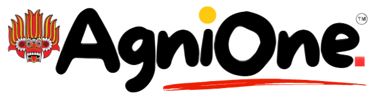
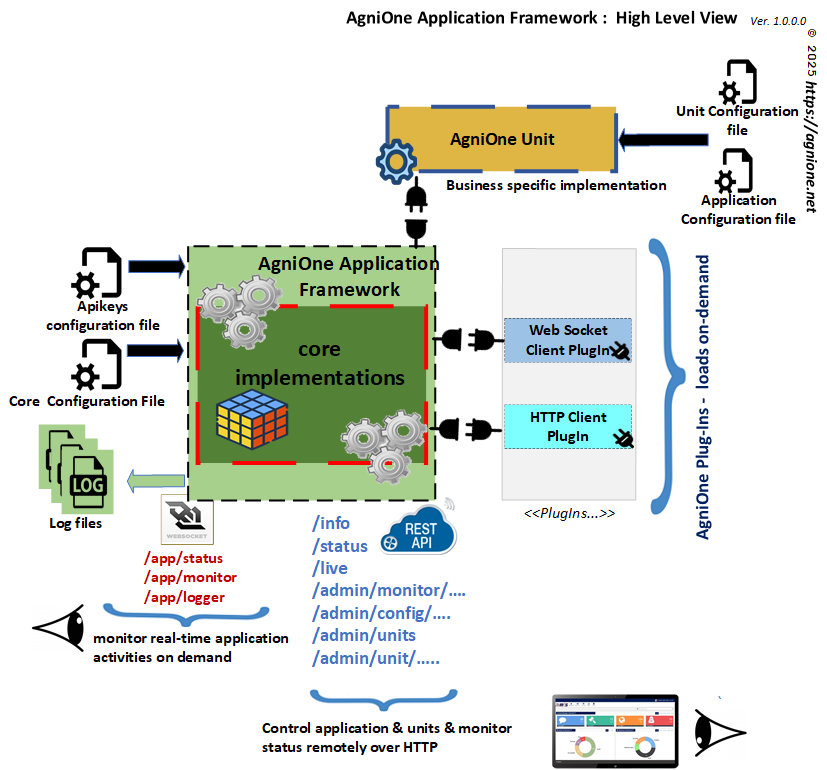
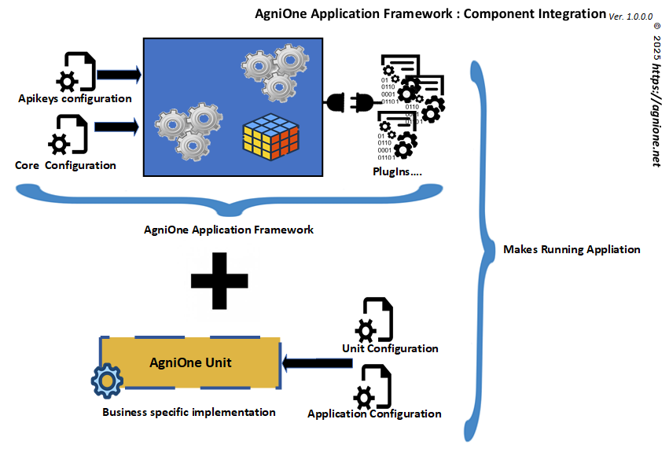

# AgniOne Application Framework .V1

## About
AgniOne is a generic High Performance extendable modular application container framework for <b>Unix</b> based systems and written in <b>100% GO</b> (https://go.dev/) . 
Heavily based on <b>Go PlugIn</b> (https://pkg.go.dev/plugin) for its fixable implementations.

It is designed and developed highly in concerns with:

- High lose coupling
- SOLID principles
- CLEAN Architecture
- Low Memory footprint & CPU usage and High Performance
- Parallelism & Concurrency as must as possible
- Easy expandability with plugins & units
- Easy deployment & maintainability
- Observability & Controllability with less effort
- Easy Containerization as Docker containers and scale as required
- Limit number of CPU Cores per for execution per instance
- Minimize & faster software development

## Architecture

AgniOne Consists with 3 main separated components:

- AgniOne Application Framework
  [Framework image comes here]
  - Main application shell
  - Act as a host for AgniOne PlugIns & Units
  - Create instance of requested AgniOne Unit(s) based on the configuration file.
  - Control AgniOne Units (load,start,stop .....)
  - Provider of AgniOne plugin instances on demand for AgniOne Units
  - Controllability via built-in REST API
  - Ability to monitor real-time activities with Web Socket on demand.

 
- AgniOne PlugIns
  - Abstract of protocol implementation with desired packages and encapsulates and exports functionalities via Interfaces.
  - Unlimited expandability with plugins.  
        By default it comes with HTTP & Web Socket plugins.
        Please refer to AgniOne PlugIns at https://github.com/agnione/plugins
  - AgniOne Framework will be creating instances of requested plugins on demand and pass those to the AgniOne Units.
  
-  AgniOne Units
   - Encapsulates Business specific logics and implementation using AgniOne Framework features.
   - Configurable via JSON formatted config file
   - Possibility load/execute units in a pool based on the configuration. (in case of load balancing required.)   
   - Sample Demo HTTP AgniOne Units is a good guide as an implementation guide. 
        Please refer to [HTTP Demo Unit] https://github.com/agnione/units

# Intraction/Integration

## Usage
AgniOne Application Framework + AgniOne PlugIns + AgniOne Units can be used to build any type of applications such as
- Unattened backend applications to perform specific tasks
- HTTP Servers/Clients
- Web Socket Servers/Clients for real-time streaming
- MQ Clients
- gPRC,protoBuf Servers/Clients

It's a matter of building required AgniOne PlugIns & AgniOne Units as per business requirements and use it with the AgniOne framework.

In the Demo HTTP AgniOne Unit, it is using the AgniOne HTTP PlugIn and as uses it to fetch URLS and their responses. 

Please refer to AgniOne HTTP Demo Unit at https://github.com/agnione/units

## Benifits
Using the AgniOne Application framework, software development time can be cut down to a significant amount, because it is only required to re-use AgniOne Plugins and build AgniOne Units.

Basically, when the AgniOne Plugins (as per requirements) are developed, AgniOne Unit will be utilizing those afterwards.
So the development has to be focused only on the business requirements and build the AgniUnit accordingly.

## Getting started
Please refer to [Start Guide](./README_Build.md)

## TODO
- CLI for controlling/Monitorin AgniOne via tpc/ip
- Full control of units via HTTP & CLI
- Load configuration via HTTP/HTTPS endpoints
- Load AgniOne Units via HTTP/HTTP endpoints
- ACL based on apikey over REST Control/Monitor endpoints

## License
Apache License

## Support
Please send an email to contact@agnione.net

## Credits
- Go Language - https://go.dev/
- Gorilla WebSocket - https://github.com/gorilla/websocket
- Color - https://github.com/fatih/color
- Go-Colorable - https://github.com/mattn/go-colorable
- Go-Istatty - https://github.com/mattn/go-isatty
- ZeroLog - https://github.com/rs/zerolog
- Lumberjack - https://github.com/natefinch/lumberjack
- jub0bs/cors - https://github.com/jub0bs/cors

## Contributors
- Images courtesy of Umesha de Silva -https://www.linkedin.com/in/umesha-de-silva-14617b27a