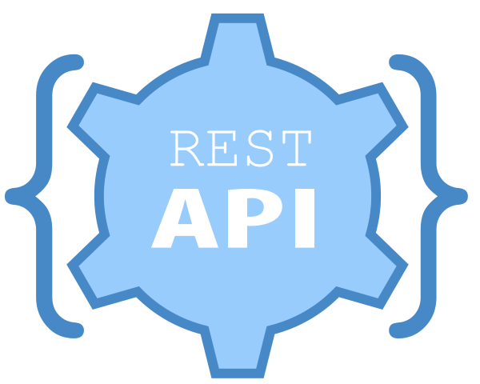
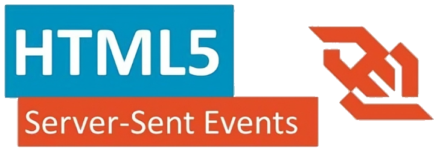
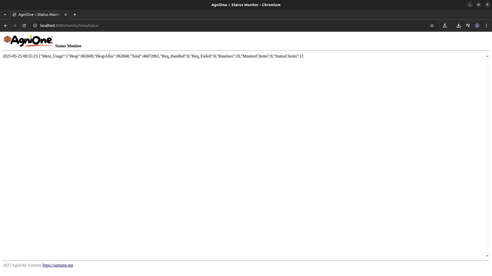
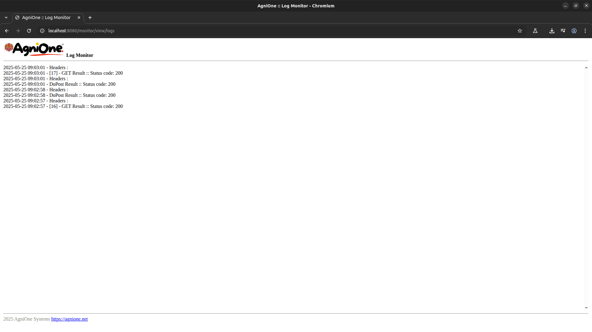
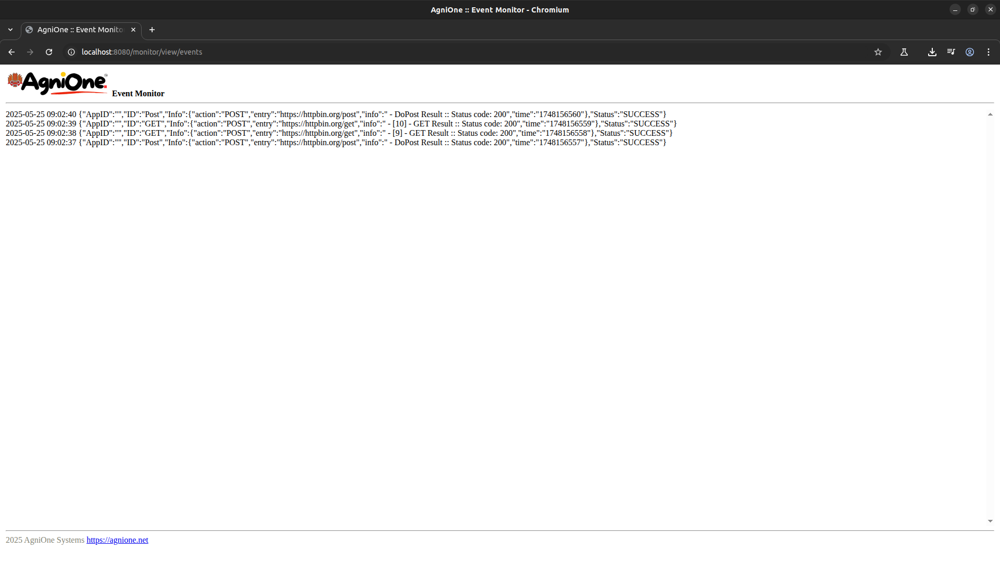

# Agni Application Framework V2 - Monitoring/Controlling

## About
Agni application framework is a generic High Performance extendable modular system written in Go 1.24 (https://go.dev/) for Unix based systems. 

When the application is running with N number of units it is possible to monitor its activities by its log files.
In order to do that person who monitor has to be in the same machine or use any observability tool so that it can be monitored remotely.

But, AgniOne Application Framework is having build-in REST and Server Sent Event (SSE) (https://developer.mozilla.org/en-US/docs/Web/API/Server-sent_events/Using_server-sent_events) monitoring features.

REST/SSE Monitoring is on by default with given IP & port in the core.config file.
   

## REST Monitoring

  There 3 types of REST APIs
   
  1. Retrieve Information
  2. Control Application   
   
  All the HTTP REST endpoint will be hosted at http://localhost:8080 by default.
   
  Check liveness -> http://localhost:8080/live

  Rest of he end points are expecting HTTP header "apikey" with valid key which is given in the AgniOne config/apikeys.config

 #### it is possible to set the log level at any time using 
  http://localhost:8080/admin/log/setlevel?level=<LOG_LEVEL>
   valid prams are <b>info,warn,debug,error </b>

eg:-  
  http://localhost:8080/admin/log/setlevel?level=info
  http://localhost:8080/admin/log/setlevel?level=warn
     

### SSE Monitoring

In order to monitor the application real-time activities over Server Sent Events (SSE), AgniOne Application contains build-in monitoring UI.
#### Monitoring UI end points      
  1. Real-time status monitor -> http://localhost:8080/monitor/view/status
  2. Real-time log monitor -> http://localhost:8080/monitor/view/logs
  3. Real-time monitor event viewer -> http://localhost:8080/monitor/view/events

#### monitoring UIs
 &nbsp;&nbsp; &nbsp;&nbsp;

#### monitoring video capture
<a href="https://agnione.net/v/agnione_monitoring.webm" target="blank">video</a>

#### Monitoing API end points
Below API endpoint can be used to build custom monitoring intrafaces or integration to external applcation as feeder and act based on the received information. 
  
  1. Real-time status monitor -> http://localhost:8080/monitor/status/read
  2. Real-time log monitor -> http://localhost:8080/monitor/logs/read
  3. Real-time monitor event viewer -> http://localhost:8080/monitor/events/read
 
 

